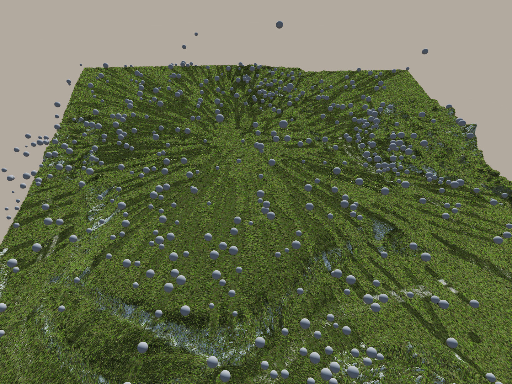

# Infos
**There is no planned maintenance of this project.**

# Screenshot

# General
Run with "Custom" Graphics Quality for 8xMSAA.

# Hotkey Settings
## Camera
	W		Move Forward
	S		Move Backward
	A		Move Left
	D		Move Right
	LMB		Rotate with Mouse Movement
	C 		Switch between Free Camera and Camera Animation Path

## Scene Management
	Numpad1	Load High Settings and Reload Simulation
	Numpad2	Load Normal Settings and Reload Simulation
	Numpad3	Load Low Settings and Reload Simulation
	Numpad4	Load Tessellation High Settings and Reload 
	Numpad5	Load Tessellation Low Settings and Reload 
	T 		Toggle Terrain Rendering
	V		Toggle Debug LOD Colors
	N 		Force blossom rendering if blossoms are off. Only useful for debugging.
	
### This ones only take effect after simulation reload:
	B 		Toggle Blossoms
	G 		Switch between Texture GrassMap Input and Uniform GrassMap Input
	Numpad6 Set SimulationTexture Resolution to 8
	Numpad7 Set SimulationTexture Resolution to 16
	Numpad8 Set SimulationTexture Resolution to 32
	Numpad9 Set SimulationTexture Resolution to 64

## Collision Interaction
	F 		Throw random sized Sphere from Camera Position
	1		Spawn several Spheres at mid of map
	2		Spawn several Cubes at mid of map
	3		Spawn several Stanford Bunnys at mid of map

## Other
	P 		Print Debug Info to Log File
